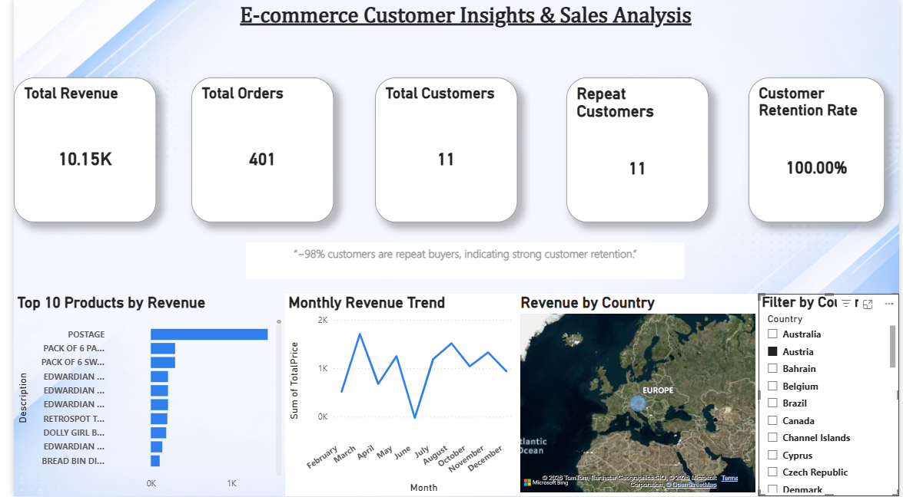
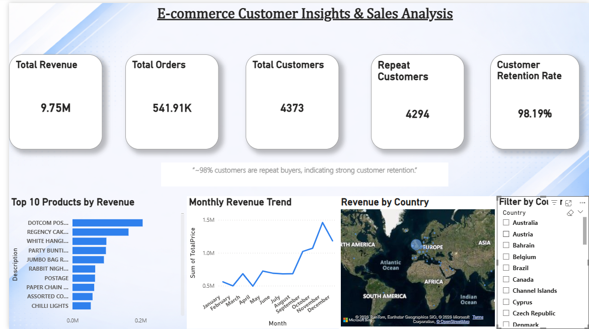
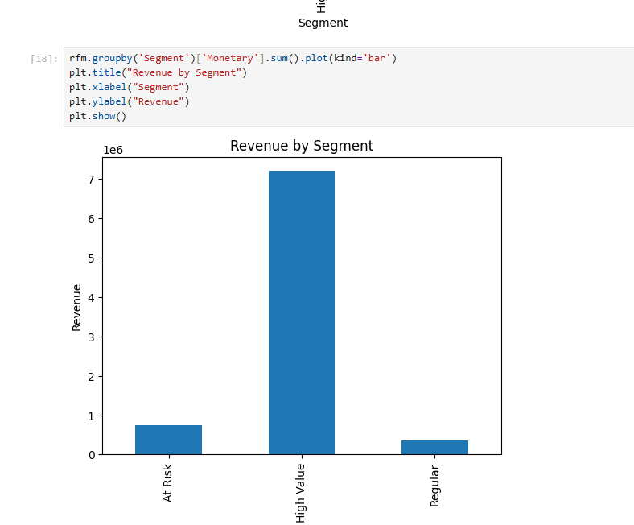

# Customer Segmentation Project

## 📊 Overview
Performed customer segmentation using RFM analysis.

## 🛠 Tools Used
- Python (Pandas)
- SQL
- Power BI

## 📈 Insights
- Identified high-value customers
- Found at-risk customers
- Analyzed purchasing behavior

## 📷 Dashboard

## 🚀 Conclusion
Converted raw data into actionable insights.
## 🔗 Project Files
Power BI file (.pbix) and dataset are included in this repository.
